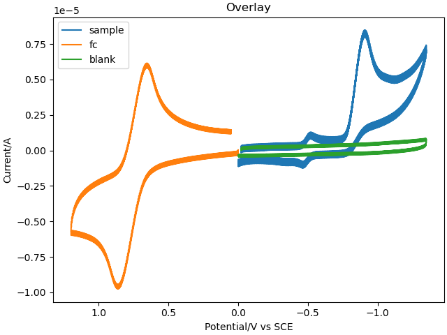
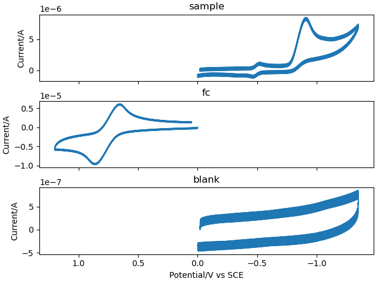
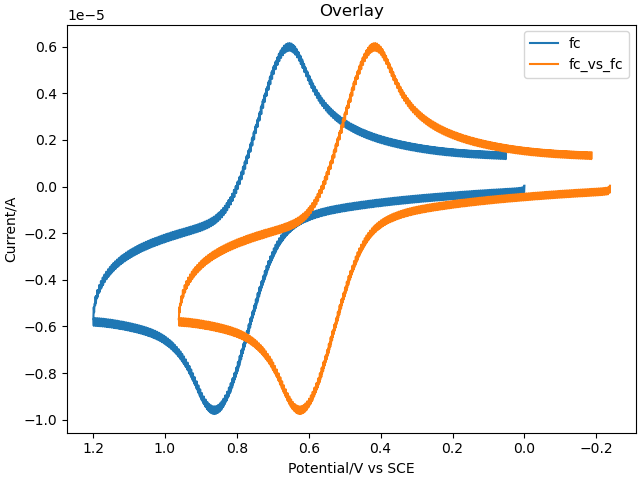
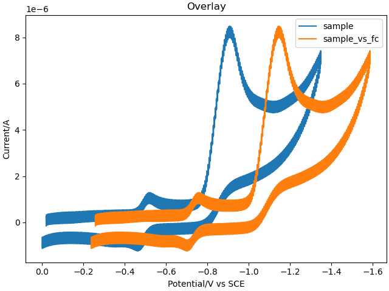
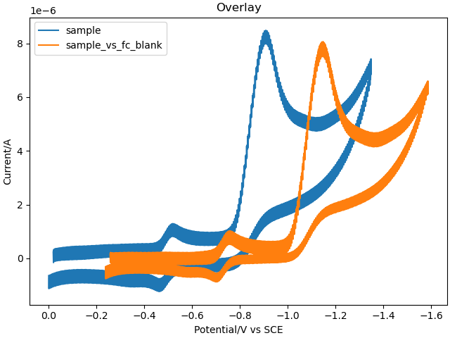

# CVProcessor

---

I wrote these scripts to process the data from cyclic voltammetry experiments I ran as a PhD student. Sure beats the cutting and pasting from excel ...not that'd I'd ever admit to having done that...

---

## The general workflow

After data collection, some additional processing is needed to make plots of the voltammograms and analyze the data. The scripts help with the following:

1. Clean up the .txt files for the sample output by the instrument, reference (ferrocene, fc, used in this example) and blank from the instrument and write a .csv file.
2. Determine the half wave potential (E1/2), the midpoint between the cathodic (Epc) and anodic (Epa) peak potentials, of the reference molecule. 
3. Shift the measured potentials to the literature value for fc in the experimental solvent (THF) used here.
4. Background subtraction of the baseline current.

---

### Example outputs

Step 1: Overlays of sample, fc, and blank from step 1 (left) stacked plots (right).

    
    

Steps 2 and 3: Overlays of the raw fc and corrected fc (left) and sample/corrected sample (right).

    
    

Step 4: Overlays of the sample and sample correctly referenced to SCE and blank subtracted.

### Notes

Feel free to modify this code to clean up your own voltammograms :)
